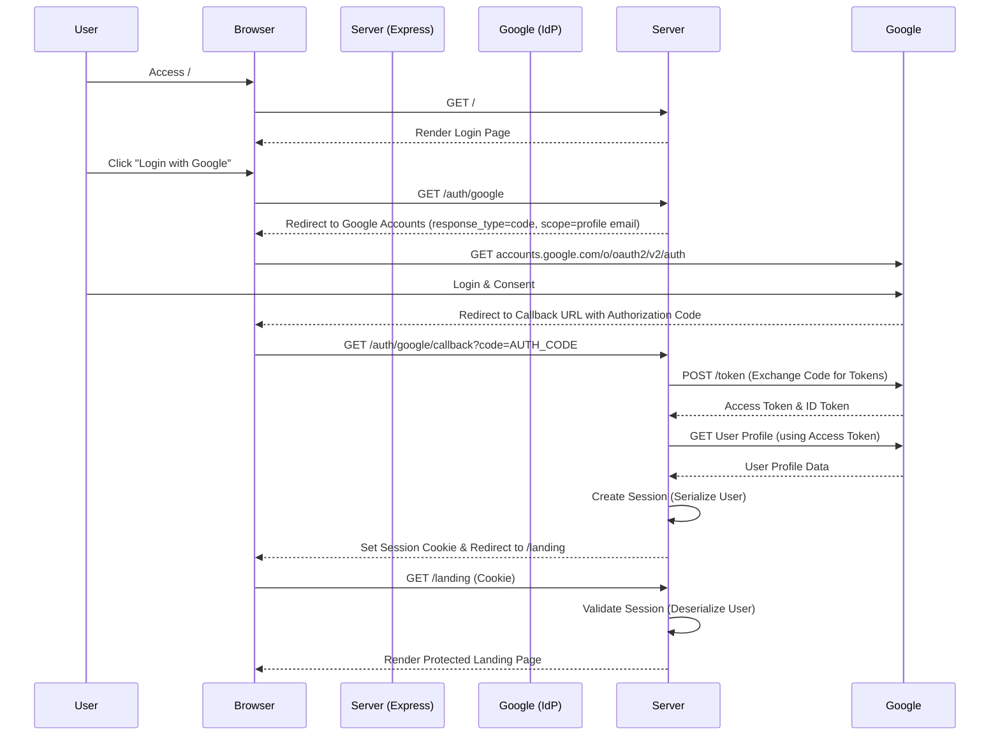

# Project SSD: Secure SSO Login with Google OAuth 2.0 - Write-up

## 1. Introduction

This document details the implementation of a **Secure Single Sign-On (SSO)** system using **Google OAuth 2.0**. The objective is to authenticate users via a Federated Identity provider (Google) while enforcing secure session management, access control, and industry-standard security practices.

The system uses **Node.js/Express** for the backend and **Passport.js** for handling the **OpenID Connect (OIDC)** protocol. Key security features such as protected routes, session persistence, and secure cookie attributes have been implemented to ensure robustness against common web vulnerabilities.

## 2. OIDC Flow Diagram

The application follows the **Authorization Code Flow** with OpenID Connect (OIDC).

**Step-by-Step Explanation:**
1.  **User Action:** The user clicks "Login with Google", targeting the server's `/auth/google` endpoint.
2.  **Redirection:** The server redirects the browser to Google's Authorization Server with the client ID and requested scopes (`profile`, `email`).
3.  **Authentication:** The user logs in and consents on Google's domain.
4.  **Authorization Code:** Google redirects back to the application's callback URL, providing a temporary **Authorization Code**.
5.  **Token Exchange (Back-Channel):** The server sends this code directly to Google (server-to-server) to exchange it for an **Access Token** and **ID Token**.
6.  **Session Creation:** Upon verifying the token, the server retrieves user details, creates a session, stores the user ID in a secure httpOnly cookie, and redirects the user to the protected `/landing` page.

## 3. Security Considerations

### State / Nonce
- **State Parameter**: `passport-google-oauth20` automatically generates and validates a `state` parameter during the authentication request. This prevents **Cross-Site Request Forgery (CSRF)** attacks by ensuring the response comes from the same browser that initiated the request.
- **Nonce**: In OIDC, a `nonce` is often used to associate the client session with the ID Token. While implicitly handled by many OIDC libraries, ensuring strict validation prevents replay attacks.

### Cookie Flags
The session cookie is configured with the following flags in `app.js`:
- **`httpOnly: true`**: Prevents client-side JavaScript (e.g., XSS attacks) from accessing the session cookie.
- **`secure: false`** (Dev) / **`true`** (Prod): In a production environment with HTTPS, this must be set to `true` to ensure cookies are only sent over encrypted connections.
- **`maxAge`**: Limits the session lifetime (set to 24 hours), reducing the window of opportunity if a session hijacking occurs.

### HTTPS
- OAuth 2.0 requires HTTPS for the redirect URI to ensure the authorization code and tokens are not intercepted in transit.
- In `localhost`, HTTP is permitted for development, but in production, a TLS certificate (SSL) is mandatory.

### Session Lifetime
- Setting a reasonable session expiration (e.g., 24 hours) balances user convenience with security. Stale sessions are automatically invalidated.
- `req.session.destroy()` ensures that when a user logs out, the session is invalidated on the server side immediately.

## 4. PKCE Implementation (Proof Key for Code Exchange)
*Note: The `passport-google-oauth20` library primarily uses the standard Authorization Code flow. PKCE is an extension often used for public clients (mobile/SPA). However, for a confidential client (server-side app like this one), Client Secret is used for authentication.*

If PKCE were to be manually implemented or enforced (typically for mobile/native apps without a client secret):
1.  **Code Verifier**: A cryptographically random string created by the client.
2.  **Code Challenge**: A SHA-256 hash of the code verifier, sent in the initial authorization request.
3.  **Verification**: When exchanging the auth code for a token, the client sends the original *Code Verifier*. Google (IdP) hashes it and compares it to the *Code Challenge* sent earlier. This proves the entity exchanging the code is the same one that initiated the request.

## 5. Conclusion

This project successfully implements a **secure, standards-compliant Authentication system** using Google OAuth 2.0. By leveraging the **Authorization Code Flow** with OIDC, the application ensures that user credentials never touch the application server, significantly reducing the attack surface.

The combination of **Passport.js** strategies, **secure session management** (httpOnly cookies), and **strict access control** provides a robust defense against common threats like Session Hijacking and CSRF. The final implementation not only meets the functional requirement of "Login with Google" but also follows best practices for modern secure software design.